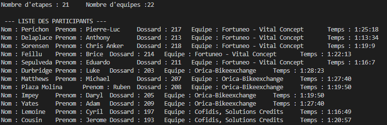
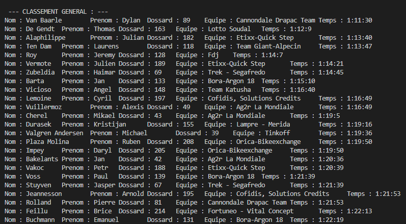
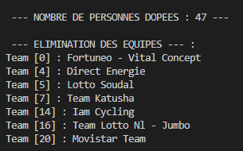
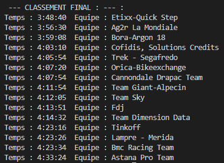

# TP Langage C


[](https://etheryo.fr/insa/tpcoureur/index.html)
## Introduction
Le programme tpcoureur fonctionne de manière aléatoire.

A chaque lancement du programme les coureurs sont lu à partir du fichier
[fichier_coureur.txt](fichier_coureurs.txt). Ces derniers vont être ensuite mis dans une liste, dans le même ordre que donné par le fichier. Ce fichier possède une convention particulière, soit :
> `1` Nombre d'étapes\
`1` Nombre d'équipe\
`x` Nom de l'équipe *x*
>>`5x` N° de dossard, Nom, `d'un coureur de l'équipe x`\
...

Les variables définies 
> `TEMPSMAX` Temps maximum qu'un coureur peut avoir\
`TEMPSMIN` Temps minimum qu'un coureur peut avoir\
`TEMPSDOP` Temps pour les joueurs dopés *(Inférieur à `TEMPSMIN`)*\

Chaque calcul de temps est randomisé selon ces variables. Elles peuvent être changées pour avoir des temps finaux différents. Mais surtout change la chance qu'un joueur soit dopé.

Le programme va tout d'abord supprimer les coureurs dopés et trier avec l'algorithme du [tri bulle][bullewiki] dans l'ordre croissant. Il va ensuite afficher les équipes éliminées : une équipe est éliminée si elle possède moins de `3 joueurs`. Et enfin elle affiche le classement final des **équipes uniquement**, seuls les temps des 3 meilleurs coureurs sont comptés.

En premier lieu les différents participants sont affichés :



Différents classements sont affichés. Tout d'abord le general :



Ensuite les différentes personnes dopées ainsi que les équipe éliminées :



Et enfin le classement final :



## Installation

Le [Makefile](/Makefile) permet de compiler et lancer le programme. Il permet aussi de nettoyer les résidus de la compilation. Pour cela il est possible de faire différentes commandes :
```
make
```
*Compile et lance le programme*
```
make clean
```
*Supprime les fichiers d'output ainsi que l'executable*
```
./main
```
*Lance le programme s'il est déjà compilé*

A noter que sur windows Le Makefile produit une erreur 127. Cela n'est produit qu'en compilation et non à l'execution.

[bullewiki]: https://fr.wikipedia.org/wiki/Tri_%C3%A0_bulles